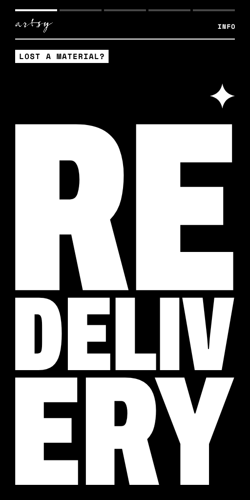
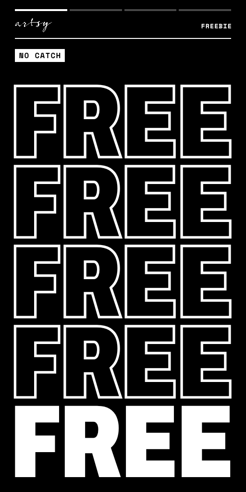
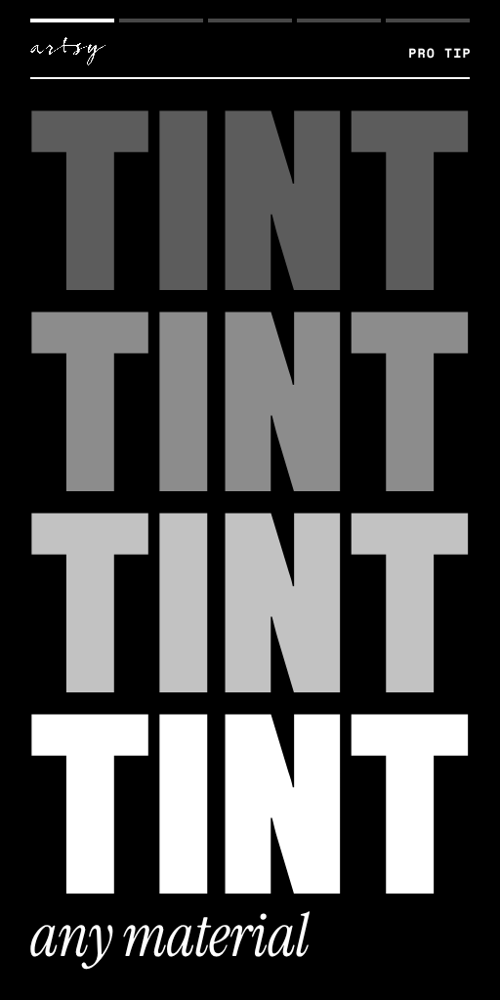
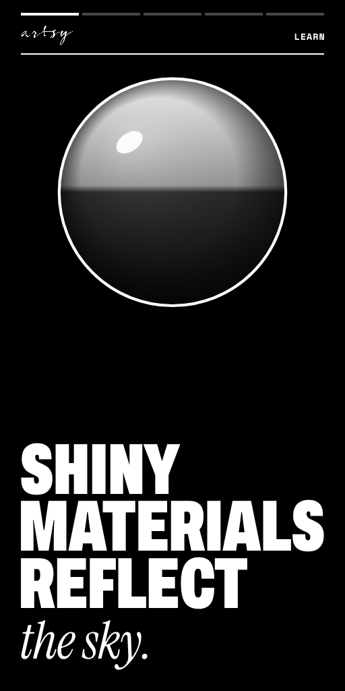
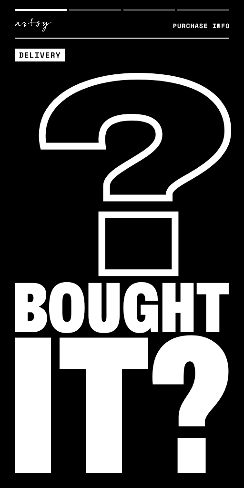
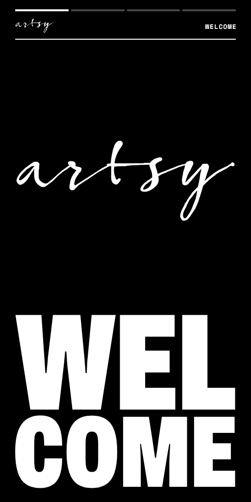

# Kinetic signs

Black-and-white motion signs for the store, made with [`signs.html`](../signs.html). Each sign is one message cut into 8 frames. A loud opener stops people walking past, then short holds stay up long enough to read.

| Preview | Sign | What it says | Loop |
|---|---|---|---|
|  | Redelivery | Click the material on the wall vendor to load it, click again to redeliver. Collections: use the terminal. | 10.2 s |
|  | Freebies | Free sample materials: plain glass, black tile, wood, metal and more. | 6.9 s |
|  | Tint | Tint any material in the texture tab. Shinier or less metal with the sliders. Tutorials on YouTube. | 8.5 s |
|  | Reflection probes | Shiny materials reflect the sky, not your room. Add a probe in three steps, then add lights. | 12.2 s |
|  | Purchase info | Purchases land in your Materials folder. Copy/Mod or Full Perm. Textures not included. | 11.5 s |
|  | Welcome | Welcome, thank you for visiting. Made with Substance Sampler, Designer, Painter and Materialize. | 7.9 s |

Every sign also comes in landscape and square. The GIFs are previews with the real timing. Upload the PNG, not the GIF.

## Formats

| Format | Frame | Grid | Sheet | Prim face |
|---|---|---|---|---|
| Portrait 1:2 | 512 × 1024 | 4 × 2 | 2048 × 2048 | 1 × 2 m |
| Landscape 2:1 | 1024 × 512 | 2 × 4 | 2048 × 2048 | 2 × 1 m |
| Square 1:1 | 512 × 512 | 4 × 2 | 2048 × 1024 | 1 × 1 m |

Every cell is used and every cell divides the sheet exactly, so there are no ghost rows or columns. At the suggested prim sizes all three come out at 512 pixels per metre. Any size with the same ratio works.

The sheets stay at 8 frames because the script does the waiting. A frame that needs to stay up for 2.5 seconds is one frame with a 2.5 second hold, not ten copies of it. Going to 16 frames would halve the resolution.

Frames are read left to right, top to bottom, which is how `llSetTextureAnim` counts them. Every frame has a thin black rim, so mipmaps at a distance never bleed a neighbouring frame onto the edge.

## Setting one up in Second Life

1. Upload the PNG. It is 24-bit with no alpha channel, so it uploads as opaque.
2. Rez a box, flatten it, and size the display face to the sign's ratio.
3. Apply the texture to that face. Full Bright on, Glow 0, Alpha mode None. Repeats and offsets don't matter; the animation sets them.
4. Drop the matching `.lsl` script into the same prim.

The script animates `ALL_SIDES`. If the box's other faces have their own textures or materials, set `FACE` at the top of the script to the display face number.

### Timing

The script's `TIMELINE` lists each frame and its seconds on screen. Edit it in-world; no new upload needed. Quick cuts (under half a second) play inside a single `llSetTextureAnim` call, so the viewer times them precisely. The script's timer only steps between holds. A run plays without `LOOP` and stays on its last frame, so lag can stretch a hold but never shows a wrong frame.

If you would rather use a plain GIF player, `llSetTextureAnim(ANIM_ON | LOOP, ALL_SIDES, cols, rows, 0, 8, 1.0)` plays any of these sheets, but every frame then gets the same time.

The quick flashes are capped at three light/dark flips in any one second, below the usual three-flashes-a-second photosensitivity limit. The studio checks this whenever you change timing.

## Zero-frame motion

Two extras in [`extras/`](extras/) move without any frames. The viewer animates a single texture, so the motion is smooth at full frame rate.

- **Ticker strip** (`artsy-ticker-2048x256.png`): text that scrolls forever and repeats seamlessly at the texture edge. `WINDOWS` in the script picks how much shows at once: 1 for an 8:1 strip (4 × 0.5 m), 2 for 4:1 (2 × 0.5 m), 4 for a 2:1 panel. Set `FLIP` if it runs the wrong way on your prim.
- **Spinning badge** (`artsy-badge-512.png`): ring text with transparent corners. Alpha mode: Alpha masking, cutoff 128. Repeats 1 × 1, no offset or rotation on the face.

## Where to put them

- **Portrait** is the default. It takes about a metre of wall and fits beside vendor walls, doors, pillars and the redelivery terminal. Tall frames also give the stacked type its biggest size.
- Put each sign where its question comes up: redelivery at the vendor wall and terminal, freebies at the giver, purchase info by the main vendor wall, welcome at the landing point.
- **Landscape** fits the dead space above vendor walls, over head height.
- **Square** suits counters and small gaps.
- A **ticker** along the top of the vendor walls adds motion at the edge of the view without taking any floor or wall space.

## Changing copy

Open [`signs.html`](../signs.html) in Chrome or Edge. Pick a sign and a format, change the copy and hold times, then export the sheet, the GIF, the script, or a zip of all three. Edits are saved in that browser. In a headline, a `|` marks where a long word may break in tall formats, as in `Re|deliv|ery`.

To re-render every file in this folder from the studio's defaults:

```sh
npm i -D playwright && npx playwright install chromium
node tools/render-signs.js
```

The script fails if any sheet breaks the rules above: a non-power-of-two size, an uneven grid, a blank or duplicate cell, or too many flashes.
