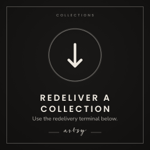
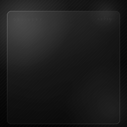
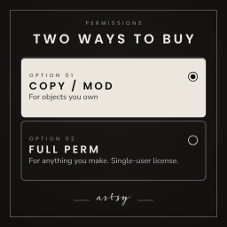
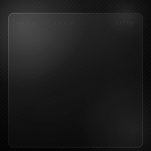
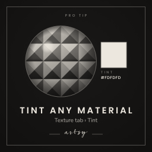
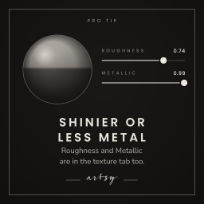
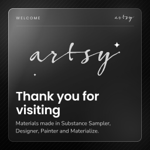
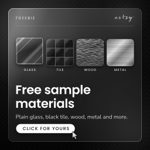
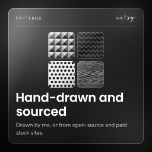

# Glass slides

One looping slide per message for the store in Second Life, made with [`signs.html`](../signs.html). Each slide slides and fades in on frosted glass, holds while people read, makes one small move, then plays its entrance backwards and starts again.

| Preview | Slide | What moves | Loop |
|---|---|---|---|
|  | Redelivery | The cursor clicks twice: loaded, then sent to your inventory | 11.4 s |
|  | Collections | The arrow nudges toward the terminal | 6.6 s |
|  | Delivery | A material drops into the Materials folder | 9.0 s |
|  | Permissions | The selection moves from Copy / Mod to Full Perm | 11.4 s |
|  | Textures | The texture maps fan out | 7.4 s |
|  | Tint | The material ball darkens as the tint changes | 8.2 s |
|  | Shine | The roughness and metallic sliders move, and the highlight sharpens | 10.4 s |
|  | Reflection probes | The probe box scales up and the ball starts reflecting the room | 11.4 s |
|  | Tutorials | The play button pulses | 6.4 s |
|  | Welcome | Light runs across the logo | 7.4 s |
|  | Freebies | The swatches lift one after another | 8.4 s |
|  | Patterns | Light passes over each pattern | 7.4 s |

The previews are half size. Upload the PNG sheets, not the GIFs.

## Fonts

Headings and labels are Poppins. Body text is Avenir LT Pro, which is a licensed font, so it is never bundled here. The files in this folder were rendered on a machine without it, so their body text uses Nunito Sans, the closest free match.

For the real thing, open `signs.html` on a computer that has Avenir LT Pro installed (a Mac's built-in Avenir also works), or click **Add Avenir LT Pro files** and pick your font files. They stay in the browser and are not uploaded. Then use **All slides in this shape (.zip)** to export the whole set.

## Sheets

Every sheet is 2048 × 2048: a 4 × 4 grid of 16 frames, 512 × 512 each. Every cell is used, so there are no empty rows or columns, and a 1 m tile shows 512 pixels per metre.

| Shape | Sheets | Build |
|---|---|---|
| Square | 1 | one 1 × 1 m panel |
| Landscape | 2 (left, right) | two 1 m tiles side by side, 2 × 1 m |
| Portrait | 2 (top, bottom) | two 1 m tiles stacked, 1 × 2 m |

Landscape and portrait slides are split into two square tiles so they keep the same sharpness and the same 16 frames. One script plays both in step.

All 16 frames follow the same plan:

| Frame | Shows |
|---|---|
| 0 | The background on its own, between loops |
| 1 to 7 | The entrance: glass rises and fades in, then the label, heading, illustration and text |
| 8 | The finished slide, held while people read |
| 9 to 15 | The accent: a second state that is also held, or light passing across the glass |

The exit is the entrance played backwards, and every pause is timed by the script, so none of them costs a frame.

## Setting one up in Second Life

Square:

1. Upload the PNG.
2. Rez a box, flatten it, and size the display face 1:1 (for example 1 × 1 m).
3. Apply the texture to that face. Full Bright on, Glow 0, Alpha mode None.
4. Drop the matching `.lsl` script into the prim.

Landscape or portrait:

1. Upload both PNGs.
2. Make two flat boxes the same size, put them edge to edge, and link them.
3. Name both prims `tile` (Build › General › Name).
4. Put the left (or top) sheet on one tile and the right (or bottom) sheet on the other.
5. Drop the script into the linked object.

The script animates `ALL_SIDES`. If a box's other faces have their own textures or materials, set `FACE` at the top of the script to the display face number.

### Timing

The script's `TIMELINE` lists each frame and its seconds on screen. Edit it in-world to change how long the message or the second state stays up; no new upload needed. The studio also has these as fields, and its exports carry your timing.

Motion frames play inside a single `llSetTextureAnim` call, forwards or with `REVERSE`, so the viewer times them precisely. The script's timer only starts each run, and a run without `LOOP` stays on its last frame. Lag can stretch a pause, but it never shows a wrong frame. A full loop takes three or four timer events.

## Zero-frame motion

Two extras in [`extras/`](extras/) move without any frames. The viewer animates a single texture, so the motion is smooth at full frame rate.

- **Ticker strip** (`artsy-ticker-2048x256.png`): text that scrolls forever and repeats seamlessly at the texture edge. `WINDOWS` in the script sets how much shows at once: 1 for an 8:1 strip (4 × 0.5 m), 2 for 4:1 (2 × 0.5 m), 4 for a 2:1 panel. Set `FLIP` if it runs the wrong way on your prim.
- **Spinning badge** (`artsy-badge-512.png`): ring text with transparent corners. Alpha mode: Alpha masking, cutoff 128. Repeats 1 × 1, no offset or rotation on the face.

## Changing copy

Open [`signs.html`](../signs.html) in Chrome or Edge. Pick a slide and a shape, change the copy and timing, then export the sheet, the GIF, the script, or a zip of everything. **All slides in this shape** exports the whole set in one zip. Edits are saved in that browser.

To re-render the files in this folder from the studio's defaults:

```sh
npm i -D playwright && npx playwright install chromium
node tools/render-signs.js                       # square
node tools/render-signs.js landscape portrait    # the two-tile shapes as well
```

The script stops with an error if a sheet breaks the rules above: not 2048 × 2048, an uneven grid, a blank cell, or too many flashes.
